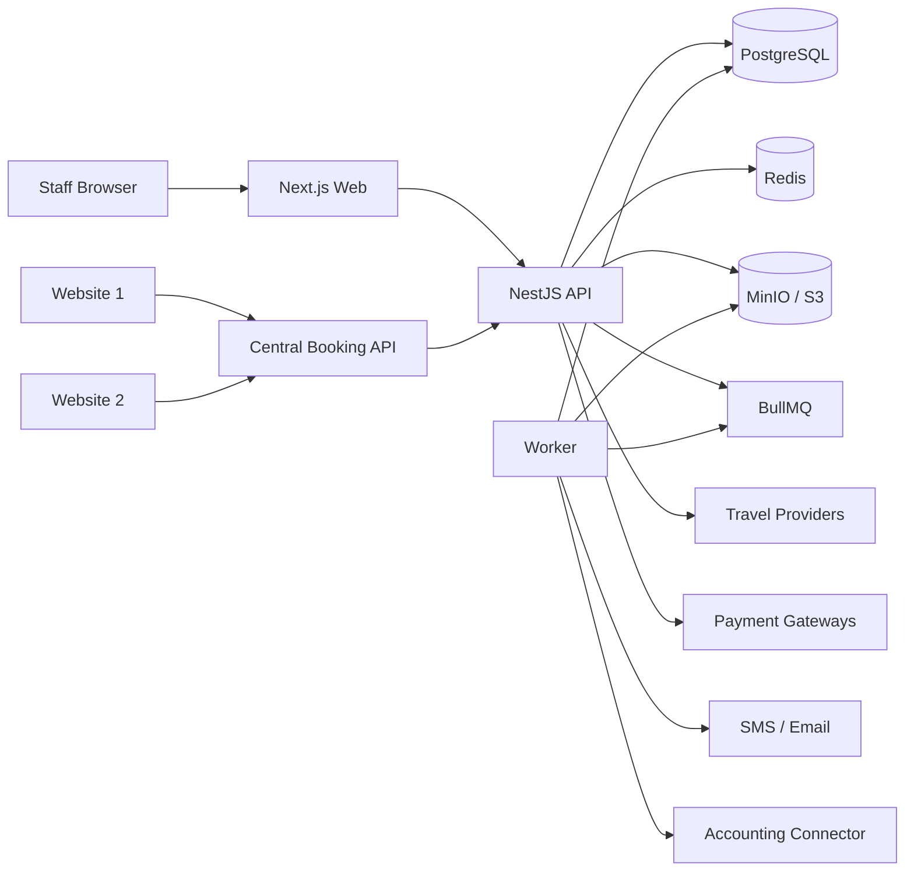
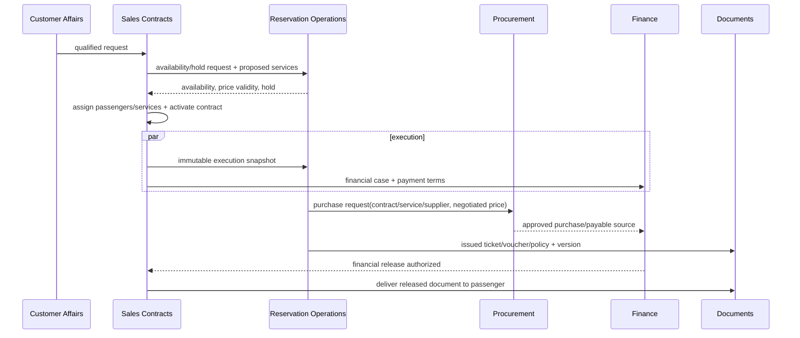
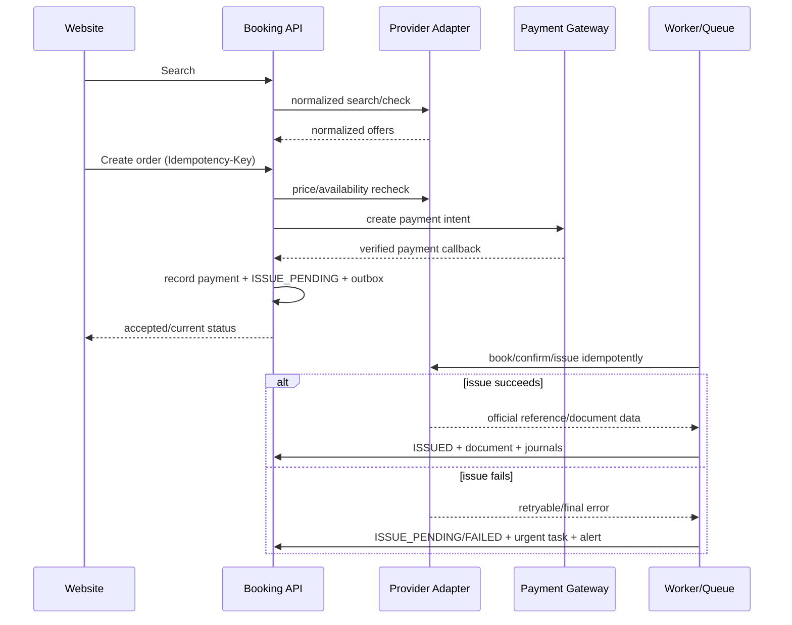

# معماری Rubi Airline CRM

وضعیت: Baseline پیشنهادی مرحله Bootstrap

سبک: Modular Monolith + Monorepo، API-first، event-assisted

## محرک‌های معماری

- تراکنش اتمیک میان سفارش، خرید و ثبت مالی بدون پیچیدگی microservice زودهنگام
- توسعه هم‌زمان Full-Stack دو کامپیوتر با مرز ماژول، داده و قفل فایل مشترک روشن
- اتصال چند Provider ناسازگار از طریق Anti-corruption Layer
- حفظ پرداخت تاییدشده هنگام شکست booking/issue و پشتیبانی از جبران
- گزارش دقیق با grain کنترل‌شده و traceability کامل
- حداقل ۳۰ کارمند با قابلیت رشد، نه معماری توزیع‌شده بدون نیاز واقعی

## نمای Context



## اجزای Monorepo هدف

```text
apps/web      Persian RTL staff UI; no direct database/provider access
apps/api      REST/Booking API, auth, orchestration, synchronous domain logic
apps/worker   Queue consumers: issue/retry/webhook/export/notification/sync
packages/contracts OpenAPI-derived/shared DTO and event contracts
packages/config validated environment/config packages
packages/database Prisma schema/client, immutable migrations after approval
packages/eslint-config shared flat ESLint configuration
packages/typescript-config shared strict TypeScript presets
infrastructure local compose, nginx and deployment assets
tests         cross-application contract, E2E and smoke suites
```

در Technical Bootstrap هنوز `packages/ui` ایجاد نشده و طراحی کامل UI در Work Item مستقل
و مطابق مالکیت ماژول انجام می‌شود. Nginx نیز تا تعیین topology و domainها عمداً اضافه
نشده است. Prisma schema در
`packages/database/prisma` قرار دارد و تا Work Item تاییدشده دامنه، model یا Migration ندارد.

## معماری داخلی Backend

هر دامنه ساختاری معادل `domain / application / infrastructure / presentation` دارد.

- Domain: entity، value object، invariant و domain event؛ بدون Nest/Prisma dependency
- Application: use case، transaction boundary، port و authorization intent
- Infrastructure: Prisma repository، Provider client، queue/storage adapter
- Presentation: controller، DTO validation، auth guard و OpenAPI

دسترسی بین ماژول‌ها فقط از public application contract یا domain event versioned است.
Import از repository داخلی یا query مستقیم table ماژول دیگر ممنوع است. درون یک
PostgreSQL، transaction هماهنگ‌کننده می‌تواند چند public command را اتمیک کند، ولی
مالک invariant همیشه ماژول صاحب داده است.

## ماژول‌ها

ماژول‌های محصول: Dashboard، Customers، Customer Affairs، Sales Contracts، Ticket Catalog،
Reservation Operations، Procurement، Finance/Treasury، Marketing، B2B، Human Resources،
Tasks/Automation، Documents، Reporting/Exports، Integrations، IAM، Master Data و Settings.
IAM و Settings در UI زیر منوی واحد «مدیریت سیستم» نمایش داده می‌شوند، ولی مرز Backend
مستقل دارند. سرویس‌های افقی: Audit، Notification، Idempotency و Observability.

فروش مالک قرارداد و تخصیص customer/passenger به service item است؛ Ticket Catalog فقط
محصول/قیمت/ظرفیت بلیت را تعریف می‌کند؛ Reservation Operations snapshot تاییدشده فروش
را اجرا و بلیت/واچر/بیمه و Manifest را صادر می‌کند. شرح قطعی در
[TRAVEL_WORKFLOW_ARCHITECTURE.md](TRAVEL_WORKFLOW_ARCHITECTURE.md) و مالکیت داده در
`MODULE_BOUNDARIES.md` است.

Human Resources مالک Employee و lifecycle استخدام است. Employee به Customer یا Passenger
تبدیل یا در آن‌ها ادغام نمی‌شود؛ ارتباط اختیاری با IAM User فقط reference حساب ورود است.
Finance نیز فقط قرارداد کنترل‌شده ورودی پرداخت حقوق را مصرف می‌کند و به جدول یا داده حساس
HR دسترسی مستقیم ندارد.

## مدل مالکیت توسعه

PC-A و PC-B هر دو Full-Stack هستند و همه لایه‌های ماژول‌های تحت مالکیت خود را توسعه
می‌دهند. فقط Migration، Dependency/Lockfile، فایل‌های مرکزی و قراردادهای cross-module
نیازمند رزرو و هماهنگی قبلی هستند. نگاشت نهایی و قواعد قفل در
[MODULE_OWNERSHIP.md](MODULE_OWNERSHIP.md) ثبت شده است.

## مدل اجرا و consistency

- عملیات حیاتی در یک request و transaction پایگاه داده، strong consistency دارند.
- side effect بیرونی با Outbox ثبت و Worker تحویل می‌دهد؛ inbox/idempotency جلوی تکرار
  webhook/command را می‌گیرد.
- Queue پیام را at-least-once تحویل می‌دهد؛ handlerها باید idempotent باشند.
- cache هرگز source of truth نیست و invalidation/TTL صریح دارد.
- state transitionهای رزرو/پرداخت/صدور با optimistic version و history ثبت می‌شوند.

### جریان فروش دستی و اجرای سفر



صدور عملیاتی، release مالی و delivery سه state مستقل هستند. رزرواسیون قرارداد یا
تخصیص مسافر را ویرایش نمی‌کند؛ نقص ورودی با correction request به فروش برمی‌گردد.

### جریان رزرو آنلاین



Payment verification و ثبت آن قبل از queue اتمیک است. شکست Provider payment را حذف
نمی‌کند؛ retry محدود، manual follow-up یا refund با workflow مجزا انجام می‌شود.

## Legal Entity output boundary

Legal Entity فقط هویت issuer و Branding را مالک است و داده عملیاتی را scope نمی‌کند. تغییر
Context با `expectedVersion` اجباری و claim اتمیک انجام می‌شود؛ نسخه مجازی اولیه صفر است.
صدور سند فقط در Context مشخص مجاز است. `DocumentTemplatePolicyPort` داخلی، template/type/
version و الزام سربرگ را از منبع trusted resolve می‌کند؛ Adapter پیش‌فرض تا اتصال واقعی
Documents fail-closed است. Issue/Reissue به Branding Version append-only با FK مرکب متصل و
همراه policy provenance و Audit در transaction ثبت می‌شوند؛ `ALL` هیچ سند ترکیبی تولید نمی‌کند.

## داده و ذخیره‌سازی

- PostgreSQL: همه داده پایدار، audit metadata، status history و reporting views
- Redis: cache کوتاه search، distributed lock، rate limit و BullMQ state
- Object Storage: binary؛ PostgreSQL فقط metadata، checksum، version و access policy
- مبلغ: Decimal + ISO currency؛ FX snapshot و rounding policy روی سند/transaction
- زمان: UTC؛ timezone/شمسی در boundary UI
- موجودی: query/materialized reporting از journal lines posted، نه فیلد قابل ویرایش

ERD و قواعد در `DATA_MODEL.md` و Data Dictionary در `DATA_DICTIONARY.md` است.

## API

REST versioned با JSON، OpenAPI، validation در boundary، error envelope ثابت، cursor/page
pagination متناسب با مورد، correlation ID و idempotency برای commandهای تکرارپذیر.
سایت‌ها Client Credential/Scope و rate limit مستقل دارند. جزئیات در `API_CONVENTIONS.md`.

## Security

JWT کوتاه‌عمر، refresh rotation/reuse detection، 2FA-ready، RBAC با scope سازمان/شعبه،
deny-by-default، encryption برای PII حساس، secret manager/environment injection، signed
URL کوتاه و audit append-only منطقی. اطلاعات کارت/CVV هرگز وارد سیستم نمی‌شود. جزئیات
در `SECURITY.md`.

## Reporting

Operational tables برای UI تراکنشی و approved views برای KPI/گزارش. Viewها grain صریح
دارند و measureهای contract/payment پیش از join با passenger/segment aggregate می‌شوند.
Export بزرگ queue-based و snapshot فیلتر/permission دارد. `REPORTING.md` مرجع است.

## Observability و قابلیت عملیات

- structured JSON log با `traceId`, `requestId`, `userId/clientId`, `module`, `operation`
  و redaction؛ PII/secret در log ممنوع
- metrics: latency/error/throughput، queue lag، provider health، payment/issue mismatch
- tracing برای API → queue → Provider، Sentry برای exception و release correlation
- health: liveness جدا از readiness؛ readiness وابسته به PG/Redis و dependency critical
- audit با actor، action، entity، before/after redacted، reason، IP و timestamp

## استقرار

Local/Test/Staging/Production کاملاً جدا. Nginx/TLS جلوی web/api، چند process API و Worker
قابل scale، PostgreSQL managed یا backup-tested، Redis durable متناسب با queue و S3
versioned. migration به‌صورت job کنترل‌شده قبل از rollout و rollback فقط backward-safe.
جزئیات در `DEPLOYMENT.md`.

## الزامات کیفی اولیه

- دسترس‌پذیری هدف و RPO/RTO هنوز تصمیم باز است.
- APIهای خواندنی معمول هدف p95 زیر 500ms بدون Provider؛ search بیرونی SLA جدا دارد.
- هر عملیات حساس trace/audit و هر dependency بیرونی timeout دارد.
- Accessibility پایه، RTL، keyboard navigation و stateهای Loading/Empty/Error/Permission.
- توسعه ابتدا modular monolith؛ extraction فقط با evidence مانند scale/failure/team boundary.

## ریسک‌های معماری

- ابهام مالی/مالیاتی می‌تواند schema و journal mapping را تغییر دهد.
- capability و reliability Providerها متفاوت است؛ contract نباید توانایی غیرواقعی فرض کند.
- گزارش grain اشتباه می‌تواند مبلغ را چندبرابر نشان دهد؛ view review اجباری است.
- PII مدارک هویتی retention و data residency تایید نشده است.
- توسعه دوکامپیوتری بدون reservation فایل/migration ریسک تعارض دارد؛ workflow اجباری است.
