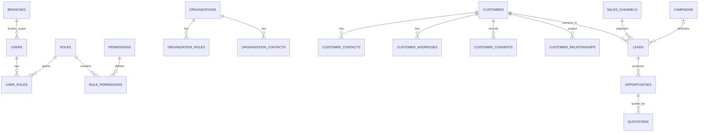
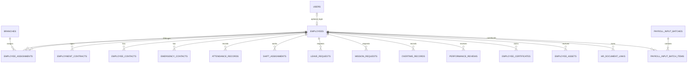
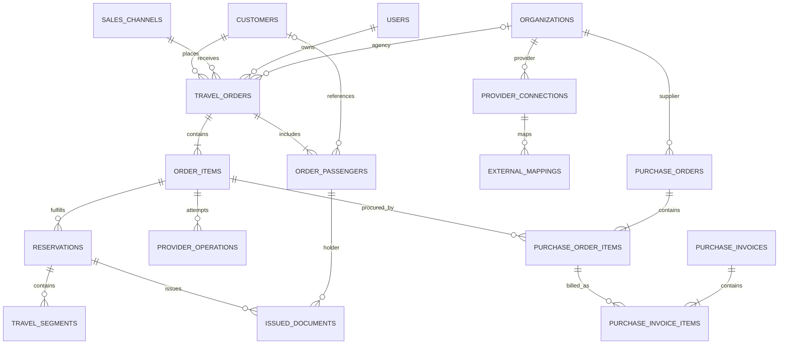
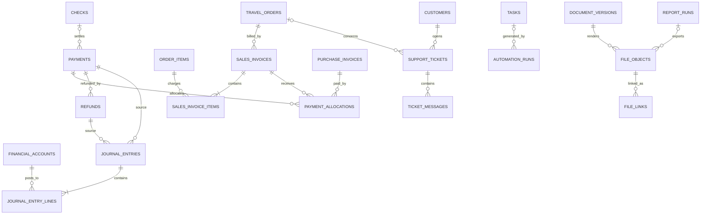

# مدل داده و ERD اولیه

وضعیت: Conceptual/Logical v0.1؛ این سند Migration نیست. نام نهایی field، enum و index
در Foundation با ADR و Prisma schema تثبیت می‌شود.

## قواعد مدل‌سازی

- شناسه عمومی پیشنهادی UUID؛ identifier بیرونی در External Mapping و با namespace یکتا.
- همه FKهای دامنه واقعی، `created_at/updated_at` به UTC و actor در عملیات حساس.
- reference/master استفاده‌شده حذف نمی‌شود؛ `is_active`/`deactivated_at` دارد.
- aggregateهای حساس `version` برای optimistic locking و جدول status history دارند.
- مبلغ `Decimal` با precision مصوب + `currency_code`; FX با rate، source و timestamp snapshot.
- PII حساس به‌صورت application-level envelope encryption و searchable hash محدود.
- file binary خارج DB؛ metadata/checksum/storage key در DB.
- ledger و audit رکورد posted را update/delete نمی‌کنند؛ correction با reversal/new entry.

## ERD هویت، سازمان و CRM

## ERD منابع انسانی

این مدل صرفاً مفهومی است و ایجاد Prisma model یا Migration را مجاز نمی‌کند. Employee
aggregate مستقل است و FK جایگزین به Customer/Passenger ندارد.

## ERD سفارش، Provider و خرید

## ERD مالی، خدمات و اسناد

## Aggregateها و invariantهای اصلی

### Identity and Access

- User چند Role و چند Branch دارد؛ joinها FK واقعی دارند و Role/Branch حذف‌شده تاریخچه
  User را cascade نمی‌کنند.
- password و refresh token فقط Hash هستند؛ Session با family، status و expiry UTC نگهداری
  و rotation/revoke به‌صورت صریح ثبت می‌شود.
- Audit رخداد امنیتی append-only و دارای actor اختیاری، outcome و زمان UTC است؛ payload
  حساس، password و token خام وارد metadata نمی‌شود.
- reference پایه `Branch` قرارداد مشترک IAM/Master Data است؛ توسعه چرخه عمر آن در مالکیت
  Master Data و مصرف access mapping در مالکیت IAM باقی می‌ماند.

### Travel Order

- حداقل یک Order Item و یک ordering customer دارد.
- مجموع‌ها از item snapshotها با rounding policy سند محاسبه می‌شوند.
- payment، booking و issue سه state مستقل‌اند؛ یک status مرکب جایگزین آن‌ها نمی‌شود.
- passenger/segment افزایش‌دهنده grain هستند و amount سفارش را duplicate نمی‌کنند.
- cancellation/refund transition نیازمند history، reason، actor و optimistic version است.

### Reservation/Issue

- هر Provider operation یک `idempotency_key`، request fingerprint، attempt و status دارد.
- official document number در صورت وجود با source Provider و external reference ذخیره می‌شود.
- issue success به document version و passenger/order item معتبر متصل است.
- issue failure payment را حذف یا void نمی‌کند.

### Procurement

- Purchase Order Item می‌تواند به Order Item متصل باشد؛ خرید عمومی اتصال order ندارد.
- Purchase Invoice پس از approval به payable و journal source یکتا تبدیل می‌شود.
- یک source document بیش از یک posting فعال ندارد؛ correction با reversal است.

### Finance

- debit و credit هر Journal Entry posted در base currency برابر است.
- مبلغ foreign currency، currency و FX snapshot روی line/document حفظ می‌شود.
- balance ذخیره قابل ویرایش نیست و از posted lines به‌دست می‌آید.
- Payment callback با gateway transaction و merchant scope unique و idempotent است.
- Allocation جمعاً از مبلغ قابل تخصیص payment/refund تجاوز نمی‌کند.

### Organization

- profile واحد است و roleها چندگانه؛ Agency/Supplier duplicate organization نمی‌سازند.
- external mapping بر `(connection_id, entity_type, external_id)` یکتا است.

### Human Resources

- Employee یک هویت دامنه مستقل است؛ Customer، Passenger یا Organization Contact به‌عنوان
  پرونده کارمند reuse نمی‌شود.
- اتصال `user_id` اختیاری و یکتا است و فقط حساب ورود را پیوند می‌دهد؛ حذف/غیرفعال‌سازی
  User تاریخچه استخدام را حذف نمی‌کند.
- assignment شعبه/واحد/سمت/مدیر و قرارداد کاری بازه زمانی و history دارند؛ هم‌پوشانی
  فقط مطابق policy مصوب مجاز است.
- حضور، شیفت، مرخصی، مأموریت و اضافه‌کاری رکورد منبع و approval history دارند و نتیجه
  تاییدشده با تغییر خام جایگزین نمی‌شود.
- Payroll Input فقط snapshot حداقلی تاییدشده برای Finance است؛ محاسبه حقوق قانونی، مالیات
  و لیست قانونی در نسخه اولیه مدل نمی‌شود.
- مشاهده، تغییر و export اطلاعات تماس اضطراری، قرارداد، ارزیابی و مدارک باید permission
  جدا و audit داشته باشد.

## تاریخچه و Audit

جداول state history برای order، reservation، payment، issue، purchase، invoice، check،
ticket، task، employment contract، leave/mission، overtime و payroll input شامل
`from_status`, `to_status`, `reason_code`, `note`, `changed_by`, `changed_at`, `trace_id`
هستند. Audit عمومی مکمل history است و جایگزین آن نیست.

## ایندکس و Constraint اولیه

- unique: normalized customer contact در scope تاییدشده؛ provider mapping؛ payment gateway
  reference؛ idempotency key در client/scope؛ document number در issuer scope
- index: status+created_at، due_date+status، customer/order foreign keys، external reference،
  sales_channel+order date، provider+service date
- partial index برای queue-like stateهای active و checkهای نزدیک سررسید
- check constraint برای amount غیرمنفی در اسناد؛ journal line فقط یک جهت debit/credit
- exclusion/unique متناسب برای جلوگیری از active duplicate posting/settlement

## مرز تراکنش

- create order + totals + initial history در یک transaction
- verify callback + payment record + allocation intent + outbox در یک transaction
- posting journal entry + lines + source posting marker در یک transaction
- merge customer با mapping/history و بدون حذف trace در transaction کنترل‌شده
- object upload دو مرحله‌ای است: pending metadata → upload/checksum → ready؛ orphan cleanup job

## Reporting model

Viewهای پیشنهادی: `reporting_order_facts` (یک ردیف/order)،
`reporting_order_item_facts`, `reporting_reservation_facts`, `reporting_passenger_facts`,
`reporting_segment_facts`, `reporting_ticket_facts`, `reporting_payment_facts`,
`reporting_journal_balance_facts`, `reporting_hr_headcount_facts` و
`reporting_hr_time_facts`. measureها قبل از join به dimension چندتایی aggregate می‌شوند.

واژه‌نامه entityها در [DATA_DICTIONARY.md](DATA_DICTIONARY.md) و KPIها در
[KPI_DICTIONARY.md](KPI_DICTIONARY.md) است.
