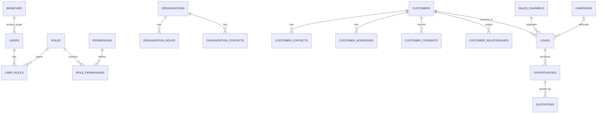
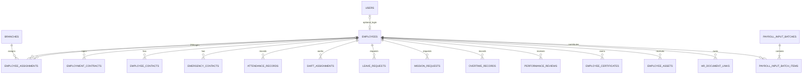
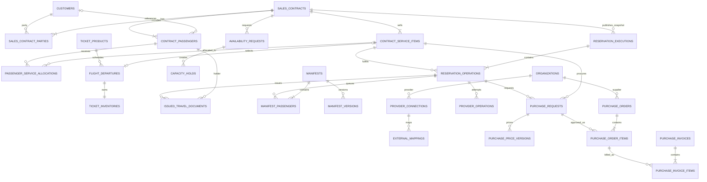
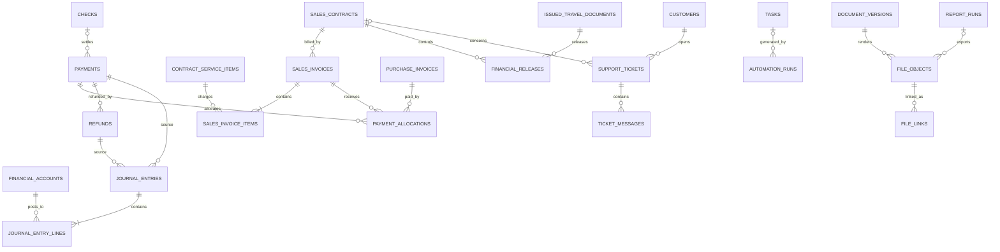

# مدل داده و ERD اولیه

وضعیت: Conceptual/Logical v0.1؛ این سند Migration نیست. نام نهایی field، enum و index
در Foundation با ADR و Prisma schema تثبیت می‌شود.

## قواعد مدل‌سازی

- شناسه عمومی پیشنهادی UUID؛ identifier بیرونی در External Mapping و با namespace یکتا.
- همه FKهای دامنه واقعی، `created_at/updated_at` به UTC و actor در عملیات حساس.
- reference/master استفاده‌شده حذف نمی‌شود؛ `is_active`/`deactivated_at` دارد.
- aggregateهای حساس `version` برای optimistic locking و جدول status history دارند.
- مبلغ `Decimal` با precision مصوب + `currency_code`; FX با rate، source و timestamp snapshot.
- PII حساس به‌صورت application-level envelope encryption و searchable hash محدود.
- file binary خارج DB؛ metadata/checksum/storage key در DB.
- ledger و audit رکورد posted را update/delete نمی‌کنند؛ correction با reversal/new entry.

## ERD هویت، سازمان و CRM

## ERD منابع انسانی

این مدل صرفاً مفهومی است و ایجاد Prisma model یا Migration را مجاز نمی‌کند. Employee
aggregate مستقل است و FK جایگزین به Customer/Passenger ندارد.

## ERD فروش، تخصیص خدمات، رزرواسیون و خرید

## ERD مالی، خدمات و اسناد

## Aggregateها و invariantهای اصلی

### Identity and Access

- User چند Role و چند Branch دارد؛ joinها FK واقعی دارند و Role/Branch حذف‌شده تاریخچه
  User را cascade نمی‌کنند.
- password و refresh token فقط Hash هستند؛ Session با family، status و expiry UTC نگهداری
  و rotation/revoke به‌صورت صریح ثبت می‌شود.
- Audit رخداد امنیتی append-only و دارای actor اختیاری، outcome و زمان UTC است؛ payload
  حساس، password و token خام وارد metadata نمی‌شود.
- reference پایه `Branch` قرارداد مشترک IAM/Master Data است؛ توسعه چرخه عمر آن در مالکیت
  Master Data و مصرف access mapping در مالکیت IAM باقی می‌ماند.

### Legal Entity و Issuer Context

- `legal_entities` دو شرکت صادرکننده واقعی با `code` یکتا، وضعیت فعال، Version خوش‌بینانه
  و فیلدهای حقوقی/تماس nullable را نگه می‌دارد؛ `ALL` هرگز در این جدول ذخیره نمی‌شود.
- `user_legal_entity_contexts` انتخاب امن هر User را با mode، issuer اختیاری و Version نگه
  می‌دارد؛ mode تجمیعی فقط پس از کنترل `legal-entity.aggregate.read` معتبر است.
- `legal_entity_branding_versions` Snapshot append-only لوگو/سربرگ/پابرگ، اطلاعات حقوقی و
  رنگ‌ها را version می‌کند؛ Trigger پایگاه داده UPDATE/DELETE هر نسخه را رد می‌کند.
- `legal_entity_document_issues` علاوه بر issuer id/code/name، با FK مرکب واقعی روی
  `(brandingSnapshotId, issuerLegalEntityId, brandingSnapshotVersion)` دقیقاً به همان Snapshot متصل است؛
  `templateId/version` و `templatePolicyId/version` trusted، actor، UTC، reference، hash، status
  و reason canonical صدور مجدد نیز ذخیره می‌شوند.
- `legal_entity_audit_events` تغییر Context، مشخصات، Branding، وضعیت و Issue/Reissue را
  append-only ثبت می‌کند؛ شناسه asset مهر/امضا فقط برای Permission مجاز برگردانده می‌شود.
- هیچ FK یا scope از Customer/Contract/Reservation/Procurement/Finance به Context فعال
  کاربر اضافه نمی‌شود؛ مصرف‌کنندگان فقط قرارداد عمومی نسخه‌دار را صدا می‌زنند.

### Sales Contract and Service Allocation

- Sales Contract حداقل یک party و یک service item دارد؛ payer/customer و passenger role
  صریح هستند و لزوماً یک شخص نیستند.
- `contract_passenger` و `passenger_service_allocation` فقط از command عمومی Sales تغییر
  می‌کنند؛ Reservations روی این روابط write access ندارد.
- هر service allocation به passenger و contract service item FK واقعی دارد؛ برای HOTEL
  room/occupancy snapshot و برای FLIGHT flight departure reference لازم است.
- قیمت فروش، تخفیف، currency و FX snapshot در contract version immutable می‌شوند.
- amendment نسخه جدید می‌سازد و executionهای قبلی را بازنویسی نمی‌کند.

### Ticket Catalog and Capacity

- Ticket Catalog مالک محصول/برنامه/fare و capacity است، ولی passenger document صادر نمی‌کند.
- Hold، confirm و release ظرفیت transaction و idempotency key دارند؛ موجودی منفی و oversell
  ممنوع است.
- تغییر زمان/قیمت/ظرفیت پس از فروش versioned است و عملیات متاثر برای Reservations task می‌سازد.

### Reservation/Issue

- Reservation Execution از contract version تاییدشده snapshot فقط‌خواندنی دارد.
- هر عملیات صدور به contract service item و passenger allocation معتبر متصل است.
- هر Provider operation یک `idempotency_key`، request fingerprint، attempt و status دارد.
- official document number در صورت وجود با source Provider و external reference ذخیره می‌شود.
- issue success به document version، contract passenger و contract service item معتبر متصل است.
- issue failure payment را حذف یا void نمی‌کند.
- Manifest در Reservations مالکیت می‌شود و `(flight_departure_id, version)` یکتا، snapshot
  passenger immutable و history ارسال/acknowledgement دارد.
- صدور عملیاتی، release مالی و delivery state مستقل هستند.

### Procurement

- Reservation از port عمومی Purchase Request را با contract/service/passenger/supplier و
  operation reference ایجاد می‌کند؛ Procurement مالک state و approval آن است.
- Purchase Order Item می‌تواند به Contract Service Item متصل باشد؛ خرید عمومی اتصال قرارداد ندارد.
- قیمت اولیه، supplier discount، fee/tax و net purchase در نسخه immutable نگه‌داری می‌شوند.
- net purchase از اجزای approved محاسبه می‌شود و margin فیلد قابل ویرایش نیست.
- Purchase Invoice پس از approval به payable و journal source یکتا تبدیل می‌شود.
- یک source document بیش از یک posting فعال ندارد؛ correction با reversal است.

### Finance

- debit و credit هر Journal Entry posted در base currency برابر است.
- مبلغ foreign currency، currency و FX snapshot روی line/document حفظ می‌شود.
- balance ذخیره قابل ویرایش نیست و از posted lines به‌دست می‌آید.
- Payment callback با gateway transaction و merchant scope unique و idempotent است.
- Allocation جمعاً از مبلغ قابل تخصیص payment/refund تجاوز نمی‌کند.
- Financial Release به contract/document و policy snapshot متصل است؛ release/revoke نیازمند
  permission، reason و history است و فایل پیش از release برای Sales/Customer قابل دانلود نیست.

### Organization

- profile واحد است و roleها چندگانه؛ Agency/Supplier duplicate organization نمی‌سازند.
- external mapping بر `(connection_id, entity_type, external_id)` یکتا است.
- Supplier و Broker پروفایل‌های role-specific با FK محدودکننده به همان Organization هستند؛
  خدمت قابل ارائه از کاتالوگ مرجع و رابطه چندبه‌چند نگه‌داری می‌شود.
- هر Organization می‌تواند چند Contact داشته باشد. تلفن و ایمیل فقط به‌صورت
  AES-256-GCM، Mask و Fingerprint ذخیره می‌شوند؛ plaintext در List، Export یا Audit نیست
  و Unmask مجاز رویداد Audit مستقل ایجاد می‌کند.
- وضعیت همکاری Supplier/Broker مرجع Master Data است؛ Contract، Purchase، Settlement و
  Provider credential در مالکیت Procurement، Finance و Integrations باقی می‌مانند.

### Master Data حمل‌ونقل

- `master_airlines` کد عمومی IATA یکتا و Uppercase، کد ICAO اختیاری یکتا، نام دوزبانه،
  کشور و Organization دارای Role ایرلاین را نگه می‌دارد؛ Credential و Connection در
  Integrations باقی می‌ماند.
- نوع هواپیما، کلاس پروازی، نوع قطار و نوع اتوبوس کاتالوگ‌های مشترک و مستقل از ناوگان،
  برنامه حرکت، قیمت و موجودی هستند. تخصیص اجرایی در Ticket Catalog/Reservations است.
- قاعده بار تاریخچه مستقل با FK ایرلاین/کلاس، نوع مسافر، دامنه مسیر، Decimal مثبت، واحد،
  تعداد قطعه و بازه اعتبار دارد؛ رکورد استفاده‌شده حذف فیزیکی نمی‌شود.
- قالب Manifest فقط ساختار و نسخه قالب را نگه می‌دارد. فایل فعال نیازمند UUID واقعی از
  قرارداد Documents است؛ Manifest مسافر و تاریخچه ارسال در Reservations باقی می‌ماند.
- شرکت ریلی و اتوبوس هرکدام به Organization و Country فعال FK محدودکننده دارند. قرارداد،
  فروش، تسویه و Provider operation در ماژول‌های مالک نگه‌داری می‌شوند.
- همه رکوردها global و مشترک دو شرکت هستند؛ Legal Entity Selector آن‌ها را فیلتر نمی‌کند
  و Branch فقط در Audit actor scope ثبت می‌شود.

### Master Data مراجع فروش

- نحوه آشنایی، منبع سرنخ، کانال فروش، دلیل از دست رفتن، نوع مشتری، Tag و نوع کمپین
  هفت کاتالوگ مستقل هستند و نباید به‌جای یکدیگر یا به‌صورت یک enum مشترک استفاده شوند.
- هر مرجع کد داخلی یکتا، نام فارسی، نام انگلیسی اختیاری، توضیح، ترتیب نمایش، وضعیت
  فعال/غیرفعال، Version خوش‌بینانه و Audit actor/time دارد. رنگ Tag فقط Hex استاندارد
  Uppercase است و ترتیب نمایش در سطح دیتابیس نامنفی کنترل می‌شود.
- اتصال Lead/Customer/Campaign/Contract به این Referenceها و شمارش مصرف آن‌ها در مالکیت
  ماژول مصرف‌کننده است. Master Data به جدول Customers یا Sales Query مستقیم نمی‌زند و
  شمارنده مصرف فقط پس از انتشار Public Aggregate Contract نمایش داده می‌شود.
- رابطه چندبه‌چند Tag با رکوردهای عملیاتی در Aggregate مصرف‌کننده نگه‌داری می‌شود؛
  Master Data فقط تعریف Tag را مالک است. رکورد استفاده‌شده حذف فیزیکی نمی‌شود و فقط
  غیرفعال می‌شود.
- همه این Referenceها global و مشترک هر دو Legal Entity هستند و selector شرکت آن‌ها را
  فیلتر نمی‌کند؛ Branch فقط در Audit actor scope ثبت می‌شود.

### Accommodation Master Data

- Hotel یک Reference مشترک میان Legal Entityها است و به City واقعی و در صورت وجود
  Hotel Chain و Organization دارای Role `HOTEL_PROVIDER` متصل می‌شود؛ selector شرکت
  روی این کاتالوگ فیلتر مالکیتی اعمال نمی‌کند.
- زمان ورود/خروج با قالب `HH:mm`، مختصات به‌صورت جفت Decimal و درجه هتل با بازه
  کنترل‌شده ذخیره می‌شوند. رکورد مصرف‌شده حذف فیزیکی نمی‌شود و Active/Saleable و
  Version خوش‌بینانه دارد.
- Meal/Service، Room Type و Facility رکوردهای مستقل کاتالوگ‌اند. اتصال آن‌ها به Hotel
  در `master_hotel_meal_services`، `master_hotel_room_types` و
  `master_hotel_facilities` نگه‌داری می‌شود و ستون Checkbox ثابت ساخته نمی‌شود.
- Composite Hotel یک Reference نمایشی فروش در یک City است؛ اعضا فقط Hotel فعال،
  فروش‌پذیر و هم‌شهر هستند، اولویت مثبت و یکتا دارند و عضو پشتیبان نیز باید عضو همان
  ترکیب باشد.
- موجودی اتاق، تخصیص مسافر و Voucher در Reservations و قرارداد و نرخ خرید در
  Procurement باقی می‌مانند. Logo/Image فقط شناسه عمومی Documents است و تا انتشار
  قرارداد واقعی فایل، باینری یا reference ساختگی ذخیره نمی‌شود.

### Human Resources

- Employee یک هویت دامنه مستقل است؛ Customer، Passenger یا Organization Contact به‌عنوان
  پرونده کارمند reuse نمی‌شود.
- اتصال `user_id` اختیاری و یکتا است و فقط حساب ورود را پیوند می‌دهد؛ حذف/غیرفعال‌سازی
  User تاریخچه استخدام را حذف نمی‌کند.
- assignment شعبه/واحد/سمت/مدیر و قرارداد کاری بازه زمانی و history دارند؛ هم‌پوشانی
  فقط مطابق policy مصوب مجاز است.
- حضور، شیفت، مرخصی، مأموریت و اضافه‌کاری رکورد منبع و approval history دارند و نتیجه
  تاییدشده با تغییر خام جایگزین نمی‌شود.
- Payroll Input فقط snapshot حداقلی تاییدشده برای Finance است؛ محاسبه حقوق قانونی، مالیات
  و لیست قانونی در نسخه اولیه مدل نمی‌شود.
- مشاهده، تغییر و export اطلاعات تماس اضطراری، قرارداد، ارزیابی و مدارک باید permission
  جدا و audit داشته باشد.

## تاریخچه و Audit

جداول state history برای sales contract، service allocation، capacity hold، reservation،
issue، manifest، financial release، purchase request/price، invoice، payment، check،
support ticket، task، employment contract، leave/mission، overtime و payroll input شامل
`from_status`, `to_status`, `reason_code`, `note`, `changed_by`, `changed_at`, `trace_id`
هستند. Audit عمومی مکمل history است و جایگزین آن نیست.

## ایندکس و Constraint اولیه

- unique: normalized customer contact در scope تاییدشده؛ provider mapping؛ payment gateway
  reference؛ idempotency key در client/scope؛ document number در issuer scope
- index: status+created_at، due_date+status، customer/contract foreign keys، external reference،
  sales_channel+contract date، provider+service date
- partial index برای queue-like stateهای active و checkهای نزدیک سررسید
- check constraint برای amount غیرمنفی در اسناد؛ journal line فقط یک جهت debit/credit
- exclusion/unique متناسب برای جلوگیری از active duplicate posting/settlement

## مرز تراکنش

- activate sales contract + immutable version + allocations + outbox در یک transaction
- hold/confirm/release ticket capacity با optimistic lock در یک transaction
- create purchase request + initial price version + history در یک transaction
- verify callback + payment record + allocation intent + outbox در یک transaction
- posting journal entry + lines + source posting marker در یک transaction
- merge customer با mapping/history و بدون حذف trace در transaction کنترل‌شده
- object upload دو مرحله‌ای است: pending metadata → upload/checksum → ready؛ orphan cleanup job

## Reporting model

Viewهای پیشنهادی: `reporting_sales_contract_facts` (یک ردیف/قرارداد)،
`reporting_contract_service_facts`, `reporting_reservation_facts`,
`reporting_contract_passenger_facts`, `reporting_ticket_inventory_facts`,
`reporting_manifest_facts`, `reporting_purchase_request_facts`,
`reporting_supplier_discount_facts`, `reporting_payment_facts`,
`reporting_journal_balance_facts`, `reporting_hr_headcount_facts` و
`reporting_hr_time_facts`. measureهای فروش/خرید پیش از join به passenger/manifest aggregate
می‌شوند تا مبلغ و margin تکثیر نشود.

واژه‌نامه entityها در [DATA_DICTIONARY.md](DATA_DICTIONARY.md) و KPIها در
[KPI_DICTIONARY.md](KPI_DICTIONARY.md) است.
