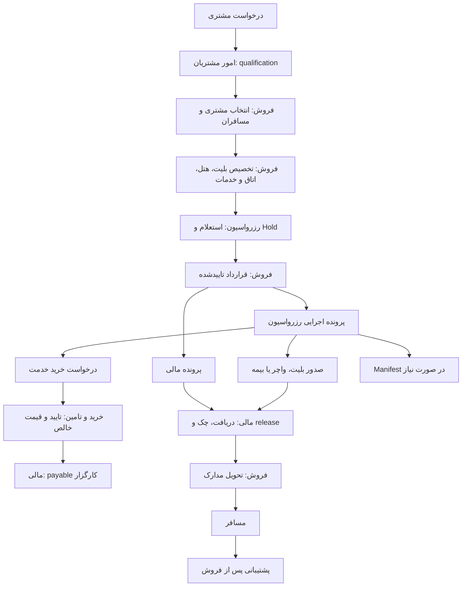

# معماری فروش و عملیات سفر نیایش سیر سحر

وضعیت: تاییدشده توسط مالک محصول — 2026-08-22

این سند مرجع قطعی مرزبندی فروش، رزرواسیون، تعریف بلیت، خرید، مالی و تحویل مدارک
است. جزئیات هر قابلیت قابل توسعه است، اما تغییر مالکیت داده یا جابه‌جایی مسئولیت‌های
این سند نیازمند ADR جدید است.

## ساختار ۱۷ بخشی

1. داشبورد
2. مشتریان و مسافران
3. امور مشتریان، سرنخ‌ها و پشتیبانی
4. رزرواسیون و عملیات سفر
5. مدیریت و تعریف بلیت‌ها
6. قراردادها، فروش و تخصیص خدمات
7. خرید و تامین
8. مالی و خزانه‌داری
9. مارکتینگ
10. آژانس‌ها و مشتریان سازمانی
11. منابع انسانی
12. وظایف و اتوماسیون
13. اسناد و فایل‌ها
14. گزارش‌ها
15. یکپارچه‌سازی‌ها
16. مدیریت سیستم
17. اطلاعات پایه

## مرزبندی قطعی مسئولیت‌ها

| عملیات | مالک معنایی و داده |
| --- | --- |
| هویت و پرونده اصلی مشتری/مسافر | مشتریان |
| درخواست اولیه، Lead و پشتیبانی قبل/بعد فروش | امور مشتریان |
| اتصال مشتری، پرداخت‌کننده و مسافر به قرارداد | فروش |
| تخصیص هر مسافر به بلیت، هتل، اتاق، بیمه، تور و خدمات | فروش |
| قرارداد، پیشنهاد، الحاقیه و مدارک ورودی قرارداد | فروش |
| تعریف محصول بلیت، برنامه پرواز، قیمت و ظرفیت قابل فروش | مدیریت بلیت‌ها |
| استعلام، Hold و اجرای خدمت تاییدشده | رزرواسیون |
| صدور بلیت، واچر و بیمه سامان | رزرواسیون |
| ساخت، نسخه‌بندی و ارسال Manifest | رزرواسیون |
| ایجاد درخواست خرید مرتبط با قرارداد/خدمت | رزرواسیون از قرارداد عمومی خرید |
| تایید و مالکیت درخواست/سفارش/فاکتور خرید | خرید و تامین |
| دریافت، پرداخت، چک و مجوز تحویل مدارک | مالی |
| ارسال مدرک آزادشده برای مسافر | فروش |
| فایل باینری، نسخه و سابقه دسترسی | اسناد و فایل‌ها |

فروش مالک قرارداد، اتصال مشتری/مسافر و تخصیص خدمات است. رزرواسیون مالک بررسی ظرفیت،
Hold، اجرای خدمت، صدور بلیت، واچر، بیمه سامان و Manifest است و فقط snapshot تاییدشده
فروش را مصرف می‌کند.

رزرواسیون حق ایجاد یا تغییر رابطه مشتری/مسافر با قرارداد و خدمات را ندارد. اگر
تخصیص یا مدرک ورودی ناقص باشد، درخواست اصلاح به فروش برمی‌گردد. رزرواسیون فقط
snapshot تاییدشده و versioned قرارداد را برای اجرا مصرف می‌کند.

## بخش‌های محصول و زیرحوزه‌ها

### ۱. داشبورد

- فروش، قرارداد، نرخ تبدیل و عملکرد کارشناس/شعبه
- صف استعلام، Hold، صدور بلیت/واچر/بیمه و Manifest
- ظرفیت کل، Hold، فروش‌رفته و باقی‌مانده
- دریافت، مانده، چک، مسدودی تحویل و بدهی کارگزار
- سود قرارداد/خدمت و تخفیف دریافتی از کارگزار
- SLA، تیکت، وظیفه و هشدارهای عملیاتی

### ۲. مشتریان و مسافران

- هویت، تماس، آدرس، پرداخت‌کننده و شخص حقوقی
- مسافر، خانواده، همراه و سرگروه
- پاسپورت، ویزا، انقضا و رضایت بازاریابی
- Customer 360 شامل قرارداد، خدمت، سند، مالی و پشتیبانی
- تشخیص و ادغام کنترل‌شده رکورد تکراری

### ۳. امور مشتریان، سرنخ‌ها و پشتیبانی

- درخواست اولیه، Lead، منبع/کانال، اولویت و تخصیص
- تماس، پیام، جلسه، یادآوری، qualification و lost reason
- تحویل درخواست واجد شرایط به فروش
- Ticket، complaint، change/cancel/refund request، SLA و escalation
- نظرسنجی رضایت و گزارش زمان پاسخ

### ۴. رزرواسیون و عملیات سفر

- استعلام بلیت/هتل/تور/بیمه، قیمت، جایگزین، Hold و expiry
- صف اجرای قرارداد با snapshot فقط‌خواندنی تخصیص‌های فروش
- صدور API/Provider/دستی یا تاییدیه ظرفیت داخلی بلیت
- PNR، official reference، reissue، void، cancel و refund
- فرم رزرو هتل، پاسخ کارگزار، Confirmation Number و واچر versioned
- بیمه سامان: issue/cancel/refund idempotent و دریافت policy/document
- Manifest دوره‌ای، قالب ایرلاین، نسخه اصلاحی/الحاقی و acknowledgement
- ساخت درخواست خرید با reference قرارداد، خدمت، مسافر و عملیات رزرواسیون

### ۵. مدیریت و تعریف بلیت‌ها

- ایرلاین، شماره پرواز، مسیر، تاریخ/زمان، کلاس، بار و قواعد
- نوع تامین: ظرفیت شرکت، چارتر، سهمیه، Provider، API یا دستی
- قیمت خرید/فروش، ارز، markup، commission و اعتبار قیمت
- ظرفیت کل، Hold، قطعی، فروش‌رفته، باقی‌مانده و جلوگیری از oversell
- version تغییر زمان/قیمت/ظرفیت، توقف فروش و لغو برنامه
- import/export گروهی و برنامه‌های تکرارشونده

این ماژول بلیت مسافر صادر نمی‌کند؛ فقط محصول و موجودی قابل فروش را منتشر می‌کند.

### ۶. قراردادها، فروش و تخصیص خدمات

- فروش جدید، مشتری، پرداخت‌کننده، مسافران و مدارک ورودی
- اتصال هر مسافر به بلیت، هتل/اتاق، بیمه، تور و خدمات جانبی
- درخواست استعلام/Hold و مصرف پاسخ رزرواسیون
- quotation versioned، قیمت، markup، تخفیف، ارز و اعتبار
- قرارداد، شرایط پرداخت/کنسلی، الحاقیه، امضا و approval
- انتشار قرارداد فعال برای مالی و رزرواسیون
- مشاهده وضعیت اجرا/مالی و ارسال مدارک آزادشده برای مسافر

### ۷. خرید و تامین

- درخواست خرید سفر ایجادشده از رزرواسیون و خرید عمومی
- قرارداد، service item، passenger، supplier و reservation reference
- قیمت اولیه کارگزار، تخفیف مذاکره‌شده، fee/tax و قیمت خالص خرید
- approval، purchase order، service receipt، purchase invoice و payable
- تغییر قیمت versioned، کنسلی، استرداد و تسویه کارگزار
- margin معتبر بر پایه قیمت فروش snapshot و قیمت خالص خرید

قیمت خالص خرید برابر است با قیمت اولیه منهای تخفیف کارگزار به‌علاوه fee و هزینه‌های
خرید. سود دستی و قابل ویرایش نیست و از فروش منهای خرید خالص محاسبه می‌شود.

### ۸. مالی و خزانه‌داری

- پرونده مالی قرارداد، پیش‌پرداخت، مانده، قسط و سررسید
- receipt، payment، refund، bank/cash account و reconciliation
- چک دریافتی/پرداختی، Sayad، سررسید، وصول، برگشت و یادآوری
- payable کارگزار و settlement
- financial release برای بلیت، واچر و بیمه‌نامه
- journal دوطرفه و balance محاسباتی

صدور عملیاتی می‌تواند مطابق policy قبل از release مالی انجام شود؛ فایل برای فروش یا
مسافر تا مجوز مالی قابل مشاهده/دانلود نیست.

### ۹ تا ۱۷

- مارکتینگ: campaign، audience، consent، UTM، attribution و conversion
- B2B: آژانس/سازمان، قرارداد چارچوب، اعتبار، نرخ توافقی و settlement
- منابع انسانی: Employee مستقل، قرارداد، حضور، مرخصی، ارزیابی و payroll input
- وظایف/اتوماسیون: task، approval، schedule، retry، notification و escalation
- اسناد: archive/version/access history؛ صدور معنایی در ماژول مالک انجام می‌شود
- گزارش‌ها: viewهای grain-safe، فیلتر و PDF/Excel/CSV/background export
- یکپارچه‌سازی: دو سایت، Providerها، بیمه سامان، درگاه و webhook
- مدیریت سیستم: IAM و Settings در یک منوی مدیریتی با مرز Backend جدا
- اطلاعات پایه: geography، airline/hotel/room/insurance/provider/leader و referenceها

## جریان مرجع فروش و اجرا

## جریان ظرفیت شرکت و Manifest

1. مدیریت بلیت محصول، برنامه و ظرفیت متعلق به شرکت را تعریف می‌کند.
2. فروش بلیت را انتخاب و مسافران را به آن تخصیص می‌دهد.
3. رزرواسیون ظرفیت را Hold و پس از قرارداد قطعی می‌کند.
4. رزرواسیون تاییدیه سفر شرکت را صادر می‌کند؛ شماره رسمی ایرلاین فقط از منبع رسمی
   ذخیره می‌شود.
5. مسافر وارد صف Manifest پرواز می‌شود.
6. Worker طبق زمان‌بندی، فایل Excel قالب همان ایرلاین را می‌سازد؛ رزرواسیون آن را
   بازبینی و ارسال می‌کند.
7. اصلاح پس از ارسال با نسخه الحاقی/اصلاحی انجام می‌شود و نسخه قبلی حذف نمی‌شود.

## جریان هتل

1. فروش هتل، اتاق و مسافران هر اتاق را در قرارداد تخصیص می‌دهد.
2. رزرواسیون استعلام و پس از قرارداد فرم رزرو کارگزار را ایجاد می‌کند.
3. رزرواسیون درخواست خرید را با قیمت و تخفیف کارگزار ثبت می‌کند.
4. تایید کارگزار و Confirmation Number ثبت می‌شود.
5. رزرواسیون واچر versioned را صادر می‌کند.
6. مالی مجوز تحویل می‌دهد و فروش واچر را برای مسافر ارسال می‌کند.

## جریان بیمه سامان

1. فروش طرح و مسافران بیمه را در قرارداد تعیین می‌کند.
2. رزرواسیون درخواست idempotent صدور را به Adapter بیمه سامان می‌دهد.
3. شماره، وضعیت و فایل بیمه‌نامه ذخیره و خرید Provider ایجاد می‌شود.
4. مالی مجوز تحویل می‌دهد و فروش بیمه‌نامه را ارسال می‌کند.

## محورهای وضعیت مستقل

هر service item حداقل چهار محور مستقل دارد:

- `capacity_status`: موجود، Hold، قطعی، آزادشده یا منقضی
- `operation_status`: منتظر اجرا، درحال صدور، صادرشده، خطا، لغو یا استرداد
- `financial_release_status`: منتظر، مشروط، مجاز یا مسدود
- `delivery_status`: آماده، دراختیار فروش، ارسال‌شده، مشاهده/دانلودشده

یک status مرکب جایگزین این محورها نمی‌شود.

## قواعد یکپارچگی

- `contract_service_item` و تخصیص passenger/service فقط توسط Sales تغییر می‌کند.
- Reservation reference و snapshot immutable لازم برای اجرا را نگه می‌دارد.
- درخواست خرید به contract، service item، supplier و reservation operation FK واقعی دارد.
- تخفیف کارگزار بخشی از خرید است؛ سود از داده posted/approved محاسبه می‌شود.
- صدور تکراری با idempotency key و unique external reference کنترل می‌شود.
- manifest، voucher، contract و documentهای تحویلی versioned هستند.
- تغییر حساس reason، actor، UTC timestamp، trace و audit دارد.
- داده PII غیرضروری در event، log، Excel یا Provider payload ارسال نمی‌شود.
