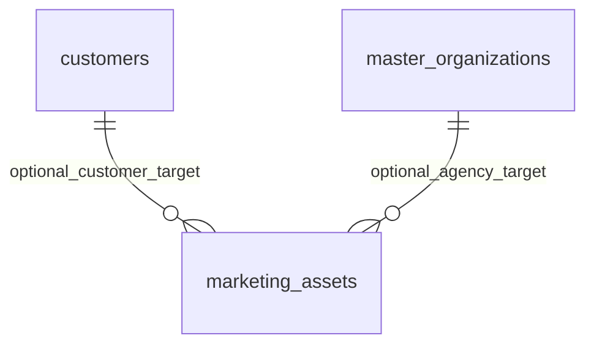

# Durable Marketing promotions

PC-B / DURABLE-PROMOTIONS-1007. Extend the existing Marketing assets producer and Web consumer with COUPON and OFFER; other kinds stay compatible. No automatic discount redemption, Sales repricing, external delivery or Finance posting.

Each promotion has at most one canonical target FK. Customers owns active/customer/branch/marketing-consent eligibility via a minimal public projection. Master Data owns active agency role and currency validation through its public directory. Marketing persists only reference IDs, never contact/name snapshots. Targeting is optional; choosing a type requires a real reference. No permission grants are introduced.

Promotion amounts use Decimal(24,4) and a currency code; canonical UTC starts/ends use existing asset timestamps. API validates discount range, capacity/per-customer limit, service/combination enum, references and validity period. A partial unique index prevents duplicate active-namespace coupon codes within a branch, including concurrent creates. Deleted codes may be reused with a new title; existing asset-name uniqueness remains unchanged.

Existing same-branch Marketing asset commands, CAS, idempotency, transaction audit and soft deletion are reused. Web closes only after validating a persisted response; failed saves retain input. Unknown outcomes freeze the submitted draft and reuse the same key on retry. Real lists replace discount/offer preview rows. Usage/redemption analytics and financial application are outside this delivery.

Public Customer/Master Data eligibility reads run before the write transaction, avoiding nested connection acquisition and pool starvation. Eligibility is checked at submission time; restrictive FKs protect identity existence at commit. Committed retries still use the original idempotency receipt. Deleted promotions cannot be revived by editing.

Migration is additive and leaves existing records unchanged. Deploy it before the new API. Rollback counterpart is staging-only and refuses if any new record/column is populated; do not delete promotion history to force rollback. Prefer retaining the additive schema and reverting application code. Prisma migration ledger rollback needs a separately approved operational procedure.

Verification includes form-shaped PostgreSQL create/reload, exact Decimal and target FK values, replay/altered-key rejection, CAS/update/delete/reload, permission and reference failures, duplicate-code rejection and rollback atomicity. UI tests cover optional/explicit targeting, no PII snapshots, error retention, malformed success and unknown retry keys. No all-project form or authenticated production-browser guarantee is implied.
