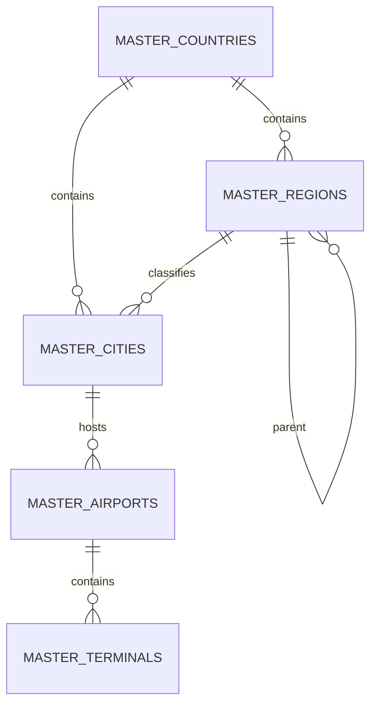

# MASTER-003B-GEO — Geography Vertical Slice

آخرین به‌روزرسانی: 2026-08-27
مالک: `PC-B`
Branch: `codex/pc-b-master-data-next`
Stacked Base: `codex/pc-b-master-data-advanced@f0d3b8c411d6e665147958e67193ac52c6ad4397`
Stacked Draft PR: `#28`

## محدوده

این Slice فقط اطلاعات جغرافیایی مشترک میان نیایش سیر سحر و جهان باستان را پوشش
می‌دهد. Country، Province/Region، City، Airport و Terminal به Legal Entity وابسته
نیستند و selector شرکت روی query آن‌ها اثری ندارد. Branch فقط در metadata رویداد Audit
ثبت می‌شود و مالکیت داده را محدود نمی‌کند.

هیچ فایل Customers، manifest یا lockfile در این Slice تغییر نمی‌کند.

## مدل و یکپارچگی

- Country دارای ISO-2 بزرگ، یکتا و معتبر است.
- Region ساختار سلسله‌مراتبی و نوع `PROVINCE | STATE | REGION | TERRITORY` دارد.
- FK مرکب Region والد و City/Region مانع ارتباط بین دو کشور می‌شود.
- City نام فارسی و انگلیسی، Country اجباری و Region اختیاری دارد.
- Airport دارای IATA و ICAO بزرگ و یکتای سراسری، IANA Timezone معتبر و مختصات
  `DECIMAL(9,6)` است.
- Check Constraintهای PostgreSQL بازه عرض `[-90, 90]` و طول `[-180, 180]`،
  قالب codeها و version مثبت را enforce می‌کنند.
- Terminal به Airport متصل و دارای نوع `DOMESTIC | INTERNATIONAL | VIP` است.
- همه FKها `ON DELETE RESTRICT` هستند؛ endpoint حذف فیزیکی وجود ندارد.
- وضعیت فعال/غیرفعال، version برای optimistic lock و Audit actor/branch برای همه منابع
  از زیرساخت مشترک Master Data استفاده می‌شود.

## ERD

## قرارداد و API

Contract عمومی `master-data.v5` پنج resource جغرافیا و filterهای
`countryId`، `regionId`، `cityId`، `airportId` و `terminalType` را منتشر
می‌کند. endpointهای عمومی Master Data برای هر resource موارد زیر را ارائه می‌کنند:

- List با Search، Filter، Sort و Pagination
- Detail
- Create
- Patch با `expectedVersion`
- Status action با `expectedVersion`
- Audit timeline و XLSX export موجود

همه endpointها از permissionهای عمومی
`master_data.read/create/update/status.manage/export` و AuthGuard استفاده می‌کنند.

## Frontend

کاتالوگ فارسی، RTL و responsive برای پنج resource با فرم‌های واقعی Create/View/Edit،
selector رابطه‌ای، validation client، وضعیت فعال/غیرفعال، search، sort، pagination و
نمایش تعارض optimistic lock تکمیل شده است. Legal Entity به query جغرافیا اضافه نشده است.

## بازبینی طراحی دیتابیس

فایل‌های `MASTER-003B-GEO.current-schema.json`،
`MASTER-003B-GEO.target-schema.json` و
`MASTER-003B-GEO.query-patterns.json` ورودی بازبینی reproducible هستند.

Schema analyzer پنج جدول، شش FK و ERD را شناسایی کرد. هشدار unique بودن code برای
Region/City/Terminal false-positive ابزار است، زیرا uniqueness آن‌ها عمداً در scope والد
به‌صورت مرکب تعریف شده است؛ IATA/ICAO و ISO سراسری یکتا هستند. Index optimizer index
پیشنهادی اصلی Terminal را گزارش کرد که دقیقاً از قبل در Migration وجود دارد؛ index
تکراری اضافه نشد. migration generator هنگام serialize مدل Column با خطای داخلی ابزار
متوقف شد؛ اعتبار Migration با Prisma validate/generate و اجرای واقعی همه Migrationها روی
PostgreSQL 18.1 جایگزین و تکمیل شد.

## پذیرش

- Frozen install: پاس
- Prisma format/validate/generate: پاس
- تمام 10 Migration روی PostgreSQL 18.1 خالی: پاس
- Seed دو بار: پاس؛ هر fixture جغرافیا دقیقاً یک رکورد
- Constraintهای uppercase، coordinate، timezone format، same-country FK و delete restrict:
  رد مورد نامعتبر در PostgreSQL تأیید شد
- Contracts/Database/API/Web testهای هدفمند: پاس
- Smoke احراز‌شده: login واقعی، پنج API جغرافیا و `/master-data` همگی HTTP 200
- دیتابیس و حساب smoke فقط موقت بودند و دیتابیس آزمون پس از پذیرش حذف شد
- lint همه فایل‌های تغییرکرده و lint کامل API/Database/Contracts: پاس
- full lint Monorepo فقط در `apps/web/src/components/ui/date-picker.tsx` متعلق به
  Parent شکست می‌خورد؛ فایل نسبت به Parent بدون تغییر است
- full typecheck، ۳۱۶ تست در ۷۷ فایل و production build همه packageها: پاس
- Scope scan: بدون فایل Customers و بدون تغییر dependency/lockfile
